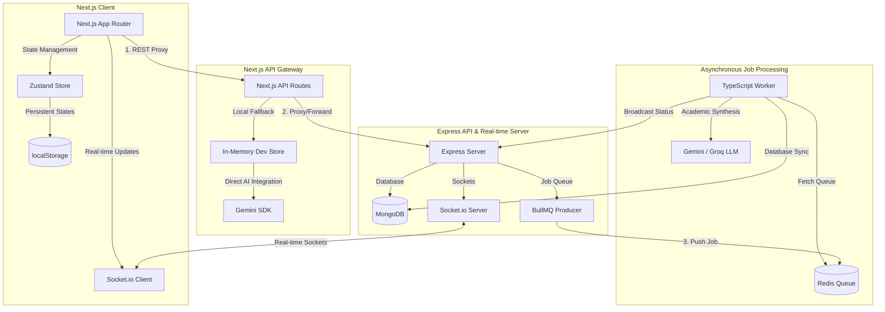

# VedaAI — AI Assessment Creator

Full-stack school exam paper generator: Next.js frontend + Express/TypeScript backend with BullMQ, MongoDB, Redis, Socket.io, and Google Gemini.

---

## Architecture Overview

VedaAI is designed as a highly robust, modular, and asynchronous full-stack application. It guarantees horizontal scalability, real-time feedback loops, and resilient fail-safe operations.



### 1. Frontend Client Layer (Next.js 14)
* **Framework**: React 18, Next.js 14 App Router, TypeScript, and TailwindCSS for modern responsive layouts.
* **State Management**: Zustand stores with `persist` middleware to handle persistent storage syncs across page reloads (e.g., assignments, draft states, persistent notifications).
* **Real-time Gateway**: Socket.io-client to establish bidirectional sockets with the backend server, receiving instant generation state changes (`PENDING` -> `PROCESSING` -> `COMPLETED`).
* **Visual Skeletons**: Localized skeleton loaders that render dashboard structural frames instantly on cold loads, avoiding blocking full-screen spinners and hydration lag.

### 2. API Proxy Gateway (Next.js Edge API)
* Act as an intermediate proxy layer between the client and the Express backend.
* **Resilient Dev Store**: If the main Express/Redis backend is offline, Next.js API fallbacks redirect requests to an in-memory development store, running Google Gemini synthesis directly inside the Next.js process. This guarantees 100% server-offline operational capabilities.

### 3. Backend Express & Socket Server
* **Server Stack**: Node.js, Express, TypeScript, and MongoDB (via Mongoose schemas).
* **Real-time Sockets**: Integrates a global `Socket.io` server bound to Express. Socket rooms are established per `assignmentId` to broadcast real-time generation milestones to connected clients.
* **PDF Kit Compiler**: A backend PDF compilation engine powered by `PDFKit` that synthesizes generated JSON test papers into high-resolution, print-ready A4 PDF documents.

### 4. Asynchronous Queue Processing (BullMQ & Redis)
* High-computation LLM calls (Gemini/Groq) are entirely decoupled from the HTTP cycle.
* Express enqueues generation tasks inside `BullMQ` producers.
* A standalone TypeScript BullMQ worker process fetches and executes the task asynchronously, updating the database record on completion and notifying the Express Socket server.

---

## Development Approach & Workflow

### 1. The Draft-to-Publish Workflow
To prevent incomplete or unreviewed content from hitting the production server, VedaAI implements a **Draft-to-Publish** flow:
* **Initial Generation**: Newly created papers from the UI form default to `"draft"` status. The background BullMQ worker compiles the initial AI draft questions.
* **In-Place Review & Regeneration**: The teacher reviews the draft on `/assignments/[id]`. If they do not like the questions, they click **Regenerate**, input custom guidance (e.g. *"Focus more on Section B, add harder algebra problems"*), and trigger a localized recreation.
* **Upload to Server**: Once satisfied, the teacher clicks **Upload to Server**, changing the status to `"published"`. The download PDF actions are fully unlocked, and an in-app persistent notification is fired.

### 2. Persistent Dynamic Notifications
* Notifications are stored locally using Zustand and persist to browser localStorage.
* Toggles beautiful drop-down popovers on Desktop and responsive overlays on Mobile.
* Bell notifications display unread indicators (`unreadCount > 0`).
* Real-time listeners monitor background worker changes to trigger notifications on draft generation completion or failure automatically.

### 3. Robust PDFKit Typographic Layouts
* Replaces absolute coordinate column layouts with native **PDFKit auto-wrapping text blocks** to resolve text merging and line overlapping.
* Implements dynamic, highly accurate page-height checking using `doc.heightOfString` to prevent orphan section headings.
* Widens answer key entries from narrow columns to take up the full horizontal printable width (415pt) of the A4 page.

---

## Prerequisites

- Node.js 18+
- MongoDB running locally (`mongodb://127.0.0.1:27017`)
- Redis running locally (`redis://127.0.0.1:6379`)
- [Google AI Studio](https://aistudio.google.com/apikey) API key for Gemini

---

## Backend setup

```bash
cd backend
cp .env.example .env
# Edit .env and set GEMINI_API_KEY
npm install
npm run dev          # API + Socket.io on :4000
npm run worker       # BullMQ worker (separate terminal)
```

---

## Frontend setup

```bash
cp .env.local.example .env.local
npm install
npm run dev          # Next.js on :3000
```

---

## API Documentation

| Method | Path | Description |
|--------|------|-------------|
| `POST` | `/api/assignments` | Create assignment draft → `202 Accepted` + `assignmentId` |
| `GET` | `/api/assignments/:id` | Fetch assignment, generated paper details, and status |
| `POST` | `/api/assignments/:id/regenerate` | Reset generation, append instructions, and restart worker enqueues |
| `POST` | `/api/assignments/:id/publish` | Promote assignment status from `"draft"` to `"published"` |
| `GET` | `/api/assignments/:id/pdf` | Generate and download official, print-ready A4 PDF document |

### WebSocket Events

* **`assignment:join`** (Client emits with `assignmentId`): Connects socket to specific room.
* **`assignment:leave`** (Client emits with `assignmentId`): Disconnects socket room.
* **`assignment:status`** (Server/worker emits payload): Broadcasts `{ assignmentId, status, error? }` to the room.

Status Timeline: `PENDING` ➔ `PROCESSING` ➔ `COMPLETED` | `FAILED`
